# Условия задачи

# Тестовое задание Computer Vision
------------------------------

В папке cv находятся изображения документов, в которых необходимо распознать все сущности и результат записать в json файл. К примеру, для изображения cv/1.jpg результат должен быть таким:

```

{ 'Выписка из протокола' : 'Комиссии Архитектурного совета по формированию городской среды',
  'дата': '11.07.00', 'номер': '11' , 'пункт': '1',
   'Наименование объекта': 'ТЭО строительства пристройки БНК к зданию средней общеобразовательной школы   № 1650',
   'Авторы проекта': 'Микоян К.С, Макарова Р.Д., Мещерский В.В.', 
   'Генеральная проектная организация': 'МОСКОМАРТ, мастерская № 1',
   'Застройщик': 'ЗАО "ТЭМ-Строй"',
   'Рассмотрение на рабочей комиссии': ' ',
   'Референт': 'Зайцых В.А.',
   'Докладчик': ' ',
   'Выступили': ' '  
}
```

Язык программирования: Python 3.6 или 3.7.
Нефункциональные требования
1. Минимальное необходимое количество библиотек-зависимостей
2. Соответствие исходного кода PEP 8


# Solution


A computer vision system that extracts rectangular blocks from document images and performs OCR (Optical Character Recognition) using EasyOCR. The system automatically detects, extracts, and maps text fields from structured documents.


## ✨ Features

- **Image Alignment** - Automatic deskewing to correct rotated documents
- **Block Extraction** - Detects rectangular regions using morphological operations
- **Text Recognition** - OCR with EasyOCR (supports Russian and English)
- **Field Mapping** - Maps detected boxes to structured field names
- **Visualization** - Generates debug images showing each processing step
- **Testing Framework** - Fuzzy comparison with expected results
- **Batch Processing** - Process multiple images in one run

## 🏗️ Architecture

```
Input Image → Deskew → Block Detection → OCR → Field Mapping → JSON Output
```

Processing pipeline:
1. **Deskew** - Aligns image based on detected skew angle
2. **Morphological Operations** - Extracts rectangular blocks
3. **Connected Components** - Identifies and filters regions
4. **OCR** - Recognizes text in each block
5. **Field Mapping** - Maps blocks to structured data fields
6. **Validation** - Compares with expected results

## 🚀 Quick Start

### Prerequisites

- [Docker](https://docs.docker.com/get-docker/) (20.10+)
- [Docker Compose](https://docs.docker.com/compose/install/) (2.0+)

### Installation & Run

1. **Clone the repository:**
```bash
git clone https://github.com/yourusername/computer-vision-document-table-parser.git
cd computer-vision-document-table-parser
```

2. **Place your images:**
```bash
# Add images to process in the input_images directory
cp /path/to/your/images/*.jpg ./input_images/
```

3. **Start the container:**
```bash
docker compose up -d
```

4. **View results:**
```bash
ls ./output_finish/
```

## 📁 Directory Structure

```
.
├── app.py                   # Main application script
├── requirements.txt         # Python dependencies
├── Dockerfile              # Docker build configuration
├── docker-compose.yml      # Docker Compose configuration
├── input_images/           # Place input images here
├── output_finish/          # Processed results
│   ├── debug/              # Debug visualization images
│   ├── *_aligned.jpg       # Deskewed images
│   ├── *_boxes.jpg         # Detected boxes visualization
│   ├── *_mapped_results.json  # Structured data output
│   └── ocr_results.json    # Raw OCR results
└── test_data/
    ├── expected/           # Expected results for testing
    └── output/             # Test outputs
```

## 🎯 Usage

### Process a Single Image

```python
from app import process_image_with_ocr

process_image_with_ocr(
    img_path="./input_images/document.jpg",
    dilation_size=7,
    std_multiplier=1.0,
    min_size=500,
    output_dir="./output_finish/",
    ocr_padding=10
)
```

### Batch Process Images

```python
from app import batch_process

batch_process(
    input_dir="./input_images",
    output_dir="./output_finish/",
    dilation_size=7,
    min_size=500,
    ocr_padding=10
)
```

### Run via Docker

```bash
# Build and start container
docker compose up --build -d

# Run the processing
docker compose exec app python app.py

# View logs
docker compose logs -f

# Stop container
docker compose down
```

## ⚙️ Configuration

### Parameters

| Parameter | Default | Description |
|-----------|---------|-------------|
| `dilation_size` | 7 | Kernel size for morphological dilation |
| `std_multiplier` | 1.0 | Multiplier for gradient threshold |
| `min_size` | 500 | Minimum component size in pixels |
| `ocr_padding` | 10 | Padding around boxes for OCR |
| `show_plots` | False | Display debug visualizations |
| `save_images` | True | Save intermediate debug images |

### Field Mapping

Edit the `field_mapping` dictionary in `app.py` to customize field extraction:

```python
field_mapping = {
    1: 'Field Name 1',
    2: 'Field Name 2',
    3: 'Field Name 3',
    # ...
}
```

## 📊 Output Format

### Mapped Results (JSON)

```json
{
  "Выписка из протокола": "Text value",
  "дата": "2024-01-15",
  "номер": "123/2024",
  "Наименование объекта": "Building Name",
  "Авторы проекта": "Author Name"
}
```


### Debug Images

The system generates step-by-step visualizations in `output_finish/debug/`:

1. `01_original_gray.jpg` - Original grayscale image
2. `02_dilation_kernel_N.jpg` - Morphological dilation
3. `03_morphological_gradient.jpg` - Gradient detection
4. `04_binary_threshold_XX.XX.jpg` - Binary thresholding
5. `05_binary_inverted.jpg` - Inverted binary
6. `06_morphological_close.jpg` - Morphological closing
7. `07_connected_components_N.jpg` - Connected components
8. `08_filtered_components_N.jpg` - Filtered components
9. `09_final_boxes_N.jpg` - Final detected boxes

## 🧪 Testing

### Run Tests

```bash
# Run test on a single image
python app.py
```

### Expected Results Format

Place expected results in `test_data/expected/[image_name].json`:

```json
{
  "Field Name 1": "Expected text 1",
  "Field Name 2": "Expected text 2",
  "Field Name 3": "Expected text 3"
}
```

### Test Output

Results are saved to `test_data/output/[image_name]_result.json`:

```json
{
  "image": "document",
  "success": true,
  "min_score": 80,
  "errors": [],
  "details": {
    "Field Name 1": {
      "status": "match",
      "score": 100,
      "expected": "Text",
      "actual": "Text"
    }
  },
  "stats": {
    "total": 11,
    "matches": 10,
    "mismatches": 1
  }
}
```

## 🐳 Docker Commands

| Command | Description |
|---------|-------------|
| `docker compose up -d` | Start in background |
| `docker compose up --build -d` | Rebuild and start |
| `docker compose down` | Stop and remove containers |
| `docker compose logs -f` | View live logs |
| `docker compose exec app bash` | Access container shell |
| `docker compose exec app python app.py` | Run the script |

## 📦 Dependencies

- **OpenCV** - Image processing
- **EasyOCR** - Text recognition
- **NumPy** - Numerical operations
- **SciPy** - Morphological operations
- **Pillow** - Image manipulation
- **FuzzyWuzzy** - Fuzzy text comparison
- **Matplotlib** - Visualization

## 📝 License

The MIT License

---

## Quick Reference Card

```bash
# One-time setup
git clone <repo>
cd <repo>
docker compose up --build -d

# Add images
cp your_image.jpg input_images/

# Process images
docker compose exec app python app.py

# View results
ls output_finish/
cat output_finish/*_mapped_results.json

# Clean up
docker compose down -v
```


## OCR Visualization Results

## Main Results

### Image 1
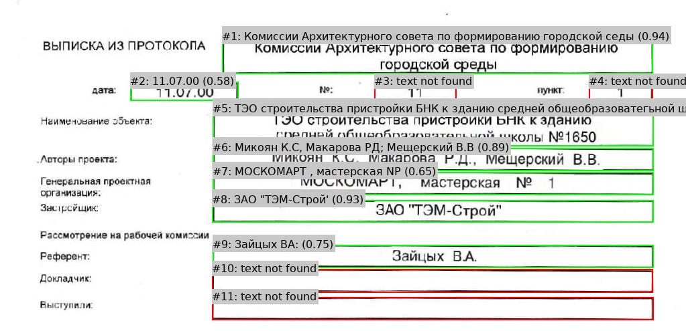

### Image 2
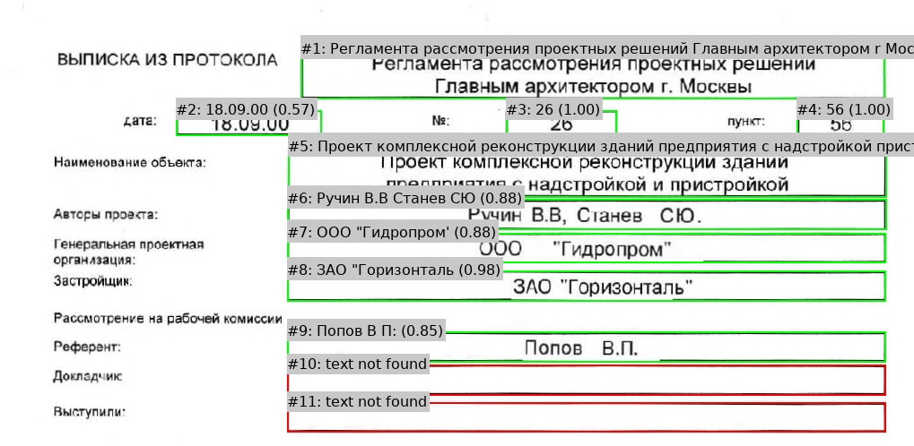

### Image 3
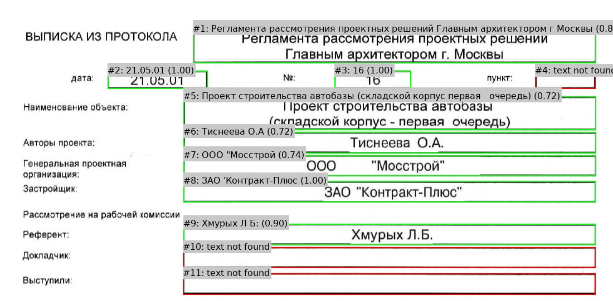

### Image 4
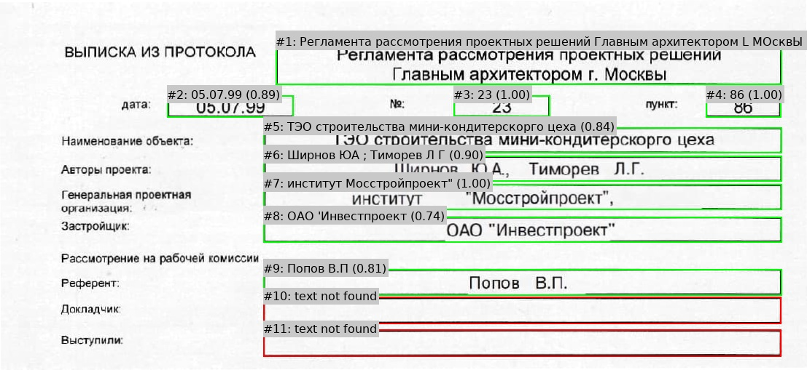

---

## Debug Images

Step-by-step debug outputs from the image processing pipeline:

### 1. Original Grayscale
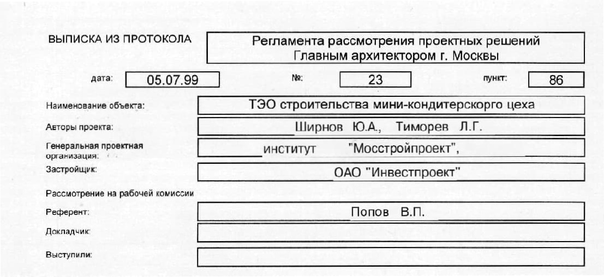

### 2. Dilation
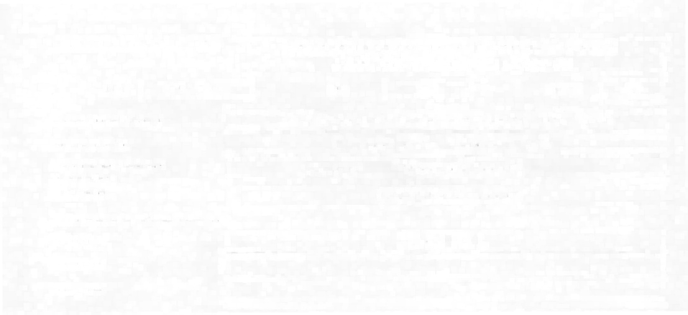

### 3. Morphological Gradient
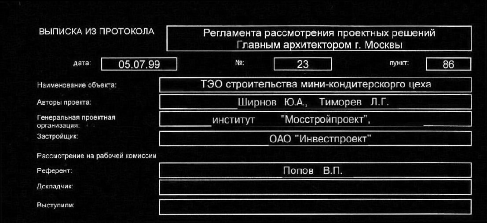

### 4. Binary Threshold
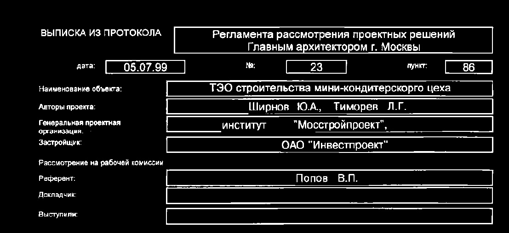

### 5. Binary Inverted


### 6. Morphological Close
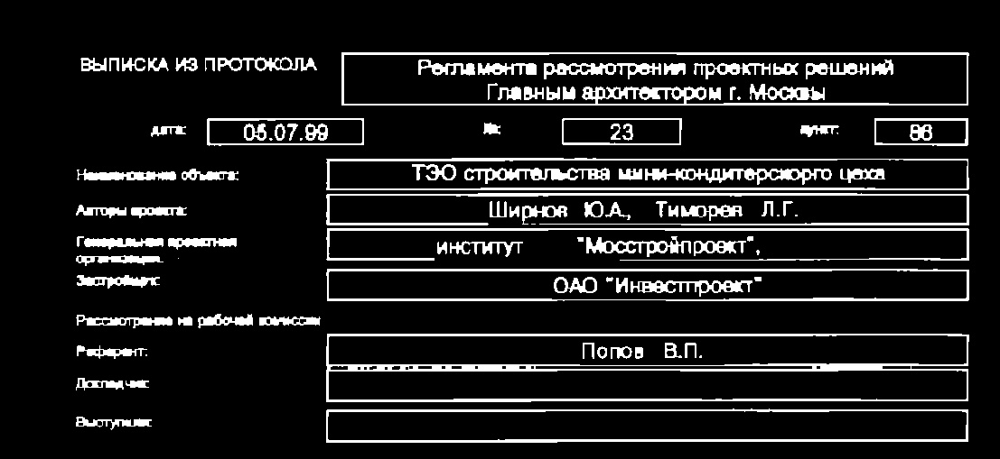

### 7. Connected Components
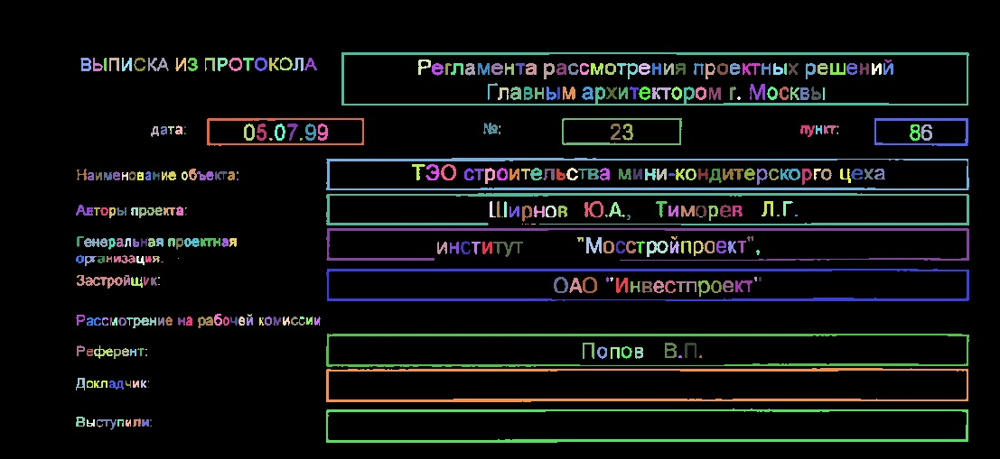

### 8. Filtered Components
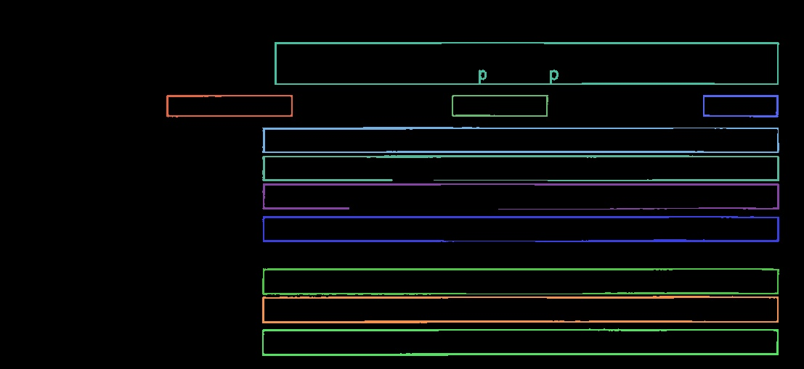

### 9. Final Boxes
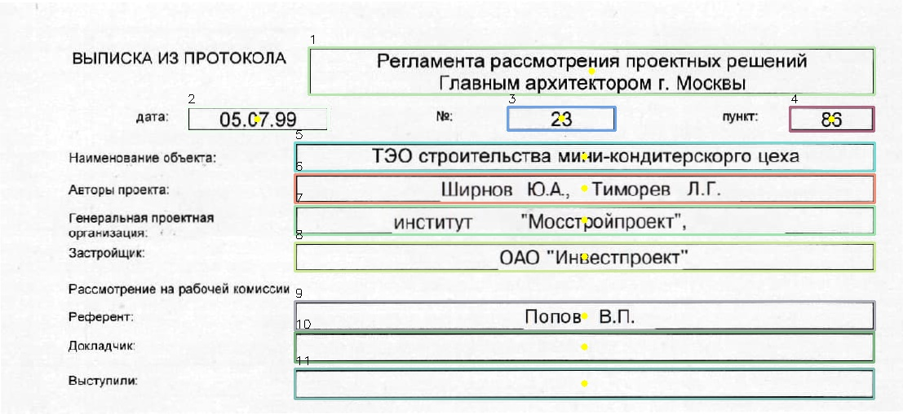


 
## JSON output

```json
{
  "Выписка из протокола": "Регламента рассмотрения проектных решений Главным архитектором L МОсквЫ",
  "дата": "05.07.99",
  "номер": "23",
  "пункт": "86",
  "Наименование объекта": "ТЭО строительства мини-кондитерскорго цеха",
  "Авторы проекта": "Ширнов ЮА ; Тиморев Л Г",
  "Генеральная проектная организация": "институт Мосстройпроект\"",
  "Застройщик": "ОAО 'Инвестпроект",
  "Референт": "Попов В.П",
  "Докладчик": "",
  "Выступили": "",
  "Рассмотрение на рабочей комиссии": ""
}

```

